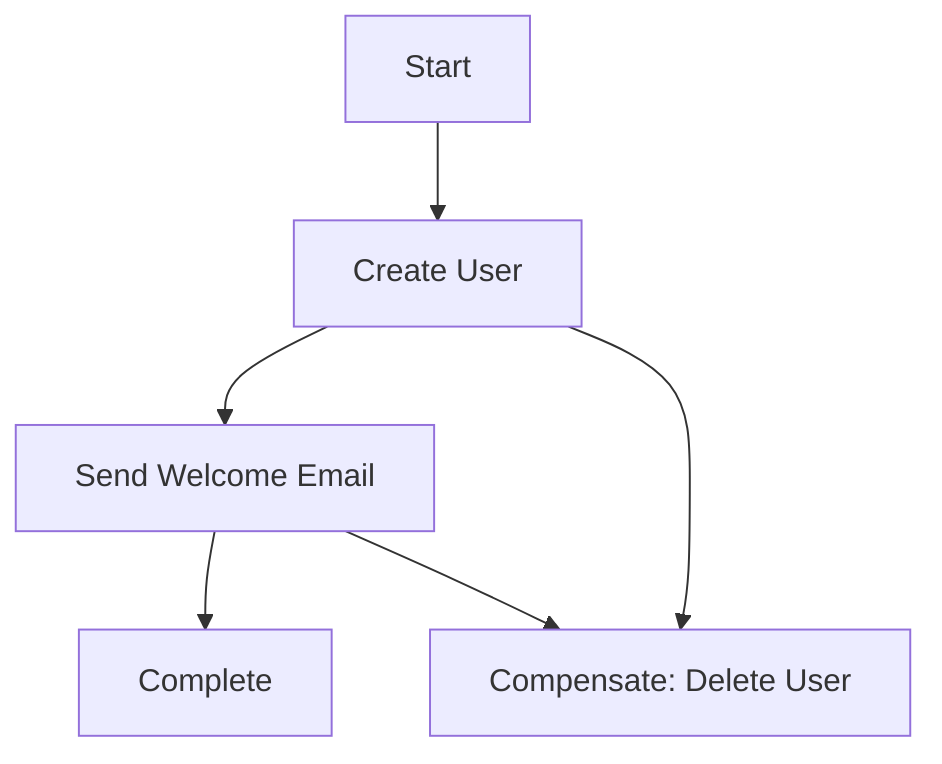
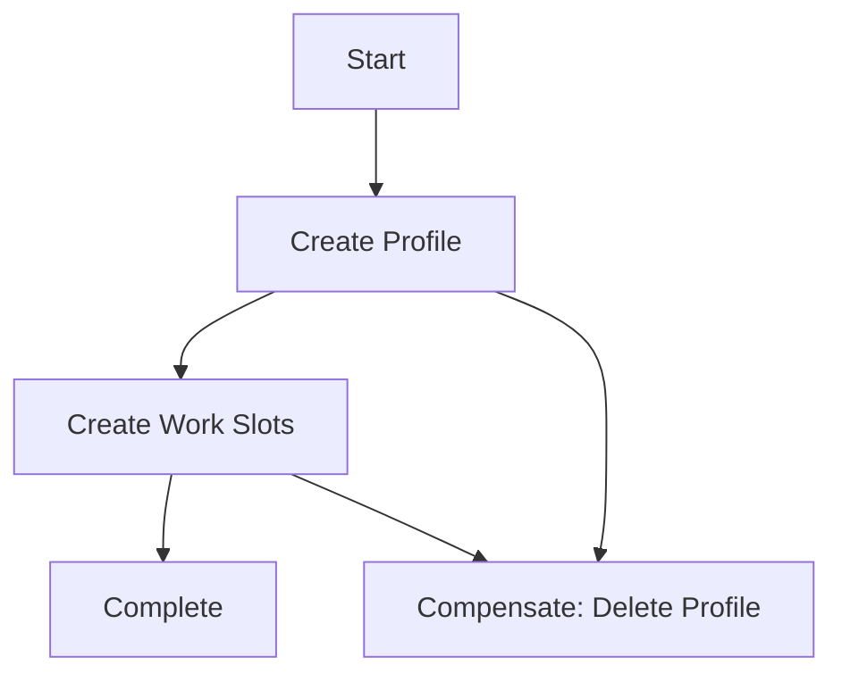
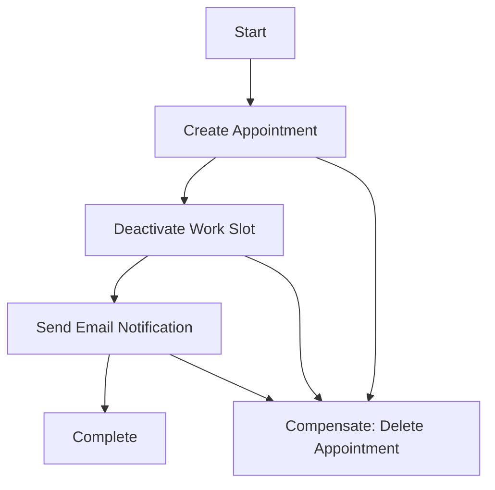
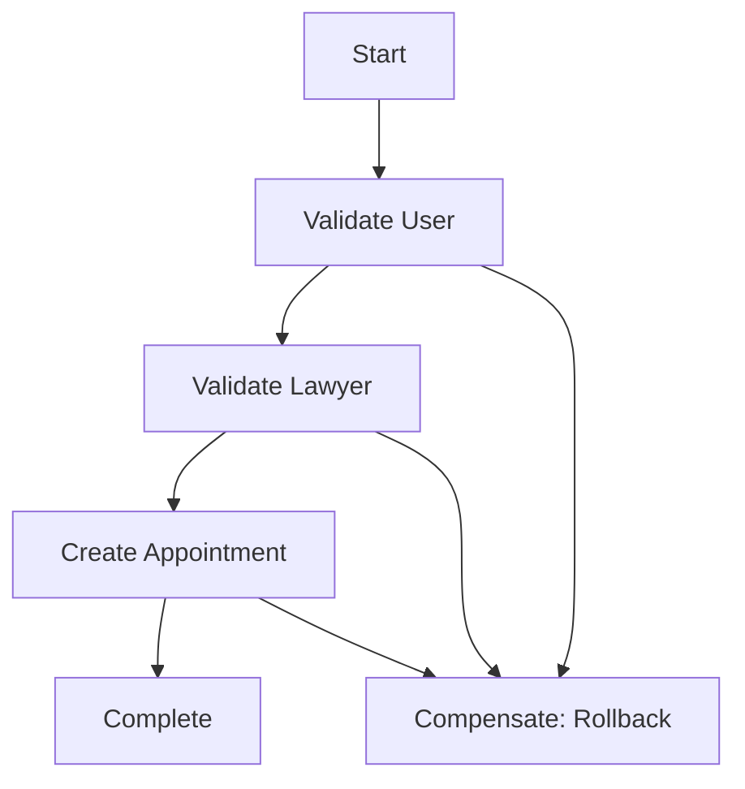

# 🏗️ Microservice Architecture & Saga Pattern Implementation

## 📋 Tổng quan

Project đã được thiết kế và triển khai theo kiến trúc **Microservice** với **Saga Pattern** để đảm bảo tính nhất quán dữ liệu và khả năng mở rộng.

## 🏛️ Kiến trúc tổng thể

```
┌─────────────────────────────────────────────────────────────┐
│                    CLIENT APPLICATIONS                      │
│  ┌─────────────┐  ┌─────────────┐  ┌─────────────┐         │
│  │   Web App   │  │  Mobile App │  │  Admin App  │         │
│  └─────────────┘  └─────────────┘  └─────────────┘         │
└─────────────────────┬───────────────────────────────────────┘
                      │
┌─────────────────────▼───────────────────────────────────────┐
│                   API GATEWAY                               │
│              (Ocelot + Cross-Service Saga)                  │
│  ┌─────────────────────────────────────────────────────────┐ │
│  │  • Routing & Load Balancing                            │ │
│  │  • Authentication & Authorization                      │ │
│  │  • Cross-Service Saga Orchestration                    │ │
│  │  • Service Discovery                                   │ │
│  │  • Health Monitoring                                   │ │
│  └─────────────────────────────────────────────────────────┘ │
└─────────────────────┬───────────────────────────────────────┘
                      │
        ┌─────────────┼─────────────┐
        │             │             │
┌───────▼──────┐ ┌───▼────┐ ┌──────▼──────┐
│ USERS SERVICE│ │LAWYERS │ │APPOINTMENTS │
│              │ │SERVICE │ │   SERVICE   │
│ ┌──────────┐ │ │        │ │             │
│ │User Mgmt │ │ │┌──────┐│ │┌──────────┐ │
│ │Auth & JWT│ │ ││Profile││ ││Appointment││
│ │Saga State│ │ ││WorkSl ││ ││Saga State││
│ └──────────┘ │ ││ots   ││ │└──────────┘ │
└──────────────┘ │└──────┘│ └─────────────┘
                 └────────┘
        │             │             │
        └─────────────┼─────────────┘
                      │
┌─────────────────────▼───────────────────────────────────────┐
│                    DATABASES                                │
│  ┌─────────────┐  ┌─────────────┐  ┌─────────────┐         │
│  │ LA_Users    │  │ LA_Lawyer   │  │LA_Appointment│         │
│  │             │  │             │  │             │         │
│  │ • Users     │  │ • Lawyers   │  │ • Appointments│        │
│  │ • Auth      │  │ • WorkSlots │  │ • Saga States│        │
│  │ • Reviews   │  │ • Diplomas  │  │             │         │
│  └─────────────┘  └─────────────┘  └─────────────┘         │
└─────────────────────────────────────────────────────────────┘
```

## 🔧 Các thành phần chính

### 1. **API Gateway** (`API.Gateway`)
- **Chức năng**: Entry point duy nhất cho tất cả requests
- **Công nghệ**: Ocelot
- **Port**: 5000 (HTTPS)
- **Tính năng**:
  - Service routing và load balancing
  - Cross-service saga orchestration
  - Service discovery
  - Health monitoring
  - CORS management

### 2. **Users Service** (`Users.Services.API`)
- **Chức năng**: Quản lý users, authentication, authorization
- **Port**: 7000 (HTTPS)
- **Database**: `LA_Users`
- **Tính năng**:
  - User CRUD operations
  - JWT authentication
  - Google OAuth
  - User saga management
  - Email notifications

### 3. **Lawyers Service** (`LA.Services.API`)
- **Chức năng**: Quản lý lawyer profiles và work slots
- **Port**: 7110 (HTTPS)
- **Database**: `LA_Lawyer`
- **Tính năng**:
  - Lawyer profile management
  - Work slot management
  - Diploma management
  - Lawyer saga management

### 4. **Appointments Service** (`Appointments.Services.API`)
- **Chức năng**: Quản lý appointments và saga states
- **Port**: 7001 (HTTPS)
- **Database**: `LA_Appointment` + `LA_Saga`
- **Tính năng**:
  - Appointment CRUD operations
  - Appointment saga management
  - Cross-service communication
  - Saga state persistence

## 🔄 Saga Pattern Implementation

### **Saga Types**

#### 1. **User Registration Saga**


#### 2. **Lawyer Profile Saga**


#### 3. **Appointment Saga**


#### 4. **Cross-Service Saga**


### **Saga State Management**

#### **Persistent Storage**
- **Database**: `LA_Saga` database
- **Table**: `SagaStates`
- **Fields**:
  - `Id`: Unique saga identifier
  - `SagaType`: Type of saga (User, Lawyer, Appointment, Cross-Service)
  - `EntityId`: Related entity ID
  - `State`: Current state (Started, InProgress, Completed, Failed)
  - `Data`: Serialized saga data
  - `ErrorMessage`: Error details if failed
  - `CreatedAt`, `CompletedAt`, `FailedAt`: Timestamps

#### **Recovery Mechanism**
- Automatic recovery of incomplete sagas on service restart
- Compensation execution for failed sagas
- State monitoring and alerting

## 🔗 Inter-Service Communication

### **Communication Patterns**

#### 1. **Synchronous HTTP**
- Direct API calls between services
- Used for real-time operations
- Timeout and retry mechanisms

#### 2. **Service Discovery**
- Dynamic service URL resolution
- Health check integration
- Load balancing support

#### 3. **Saga Orchestration**
- Centralized saga coordination
- State persistence across services
- Compensation handling

### **API Contracts**

#### **Standard Response Format**
```json
{
  "success": true,
  "data": { /* actual data */ },
  "message": "Operation successful",
  "sagaData": {
    "sagaId": "uuid",
    "state": "Completed"
  }
}
```

#### **Error Response Format**
```json
{
  "success": false,
  "message": "Error description",
  "details": "Detailed error information",
  "code": "ERROR_CODE"
}
```

## 🗄️ Database Design

### **Database Separation**
- **Users Service**: `LA_Users` database
- **Lawyers Service**: `LA_Lawyer` database  
- **Appointments Service**: `LA_Appointment` + `LA_Saga` databases

### **Saga Database Schema**
```sql
CREATE TABLE SagaStates (
    Id NVARCHAR(50) PRIMARY KEY,
    SagaType NVARCHAR(50) NOT NULL,
    EntityId NVARCHAR(50) NOT NULL,
    State NVARCHAR(50) NOT NULL,
    Data NVARCHAR(MAX),
    ErrorMessage NVARCHAR(1000),
    CreatedAt DATETIME2 NOT NULL,
    CompletedAt DATETIME2,
    FailedAt DATETIME2,
    LastUpdatedAt DATETIME2 NOT NULL
);

CREATE INDEX IX_SagaStates_SagaType_EntityId 
ON SagaStates (SagaType, EntityId);

CREATE INDEX IX_SagaStates_CreatedAt 
ON SagaStates (CreatedAt);
```

## 🚀 Deployment & Scaling

### **Docker Support**
- Individual Dockerfiles for each service
- Docker Compose for local development
- Container orchestration ready

### **Scaling Strategies**
- **Horizontal Scaling**: Multiple instances per service
- **Load Balancing**: API Gateway handles distribution
- **Database Scaling**: Separate databases per service
- **Caching**: Redis integration for performance

### **Monitoring & Observability**
- Health check endpoints for all services
- Centralized logging
- Saga state monitoring
- Performance metrics

## 🔒 Security

### **Authentication & Authorization**
- JWT tokens for service-to-service communication
- API Gateway handles authentication
- Role-based access control

### **Network Security**
- HTTPS for all communications
- CORS configuration
- Service isolation

## 📊 Performance Considerations

### **Optimization Strategies**
- Database connection pooling
- HTTP client reuse
- Caching mechanisms
- Async/await patterns

### **Monitoring**
- Health check endpoints
- Saga state tracking
- Performance metrics
- Error tracking

## 🧪 Testing Strategy

### **Unit Testing**
- Individual service testing
- Saga logic testing
- Repository testing

### **Integration Testing**
- Service-to-service communication
- Saga orchestration testing
- Database integration testing

### **End-to-End Testing**
- Complete user journeys
- Cross-service scenarios
- Failure and recovery testing

## 🔄 CI/CD Pipeline

### **Build Process**
1. Code compilation
2. Unit test execution
3. Docker image building
4. Security scanning

### **Deployment Process**
1. Database migration
2. Service deployment
3. Health check validation
4. Traffic routing

## 📈 Future Enhancements

### **Planned Features**
- Event-driven architecture with message queues
- Advanced monitoring with Prometheus/Grafana
- Circuit breaker pattern implementation
- Distributed tracing
- Auto-scaling based on metrics

### **Technology Upgrades**
- .NET 9 support
- Advanced caching strategies
- Microservice mesh (Istio)
- Advanced security features

---

## ✅ **Kết luận**

Project đã được thiết kế và triển khai hoàn chỉnh theo kiến trúc **Microservice** với **Saga Pattern**, đảm bảo:

- ✅ **Tính nhất quán dữ liệu** thông qua Saga Pattern
- ✅ **Khả năng mở rộng** với service separation
- ✅ **Fault tolerance** với compensation mechanisms
- ✅ **Service discovery** và health monitoring
- ✅ **Database separation** cho từng service
- ✅ **Docker support** cho containerization
- ✅ **Comprehensive testing** strategy
- ✅ **Production-ready** architecture

Kiến trúc này sẵn sàng cho production deployment và có thể mở rộng theo nhu cầu business! 🎉
